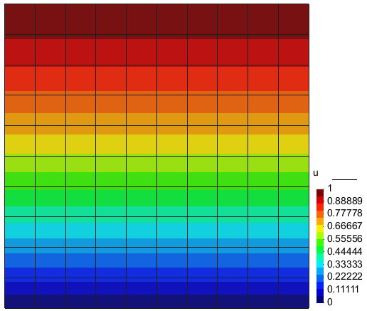
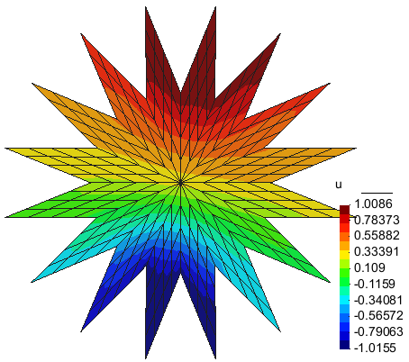
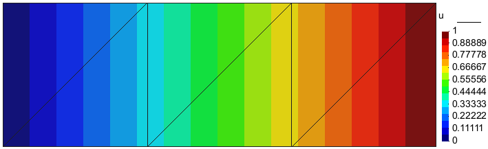
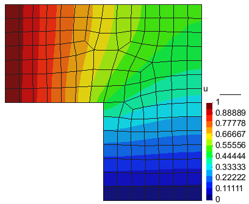
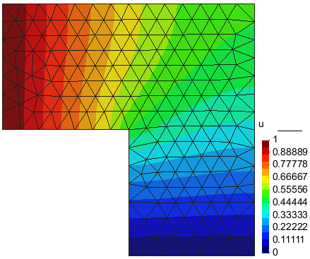
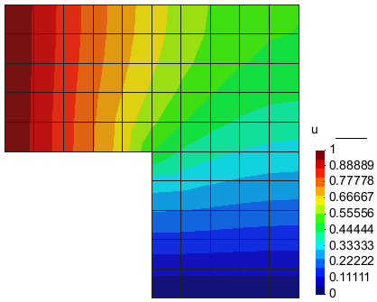
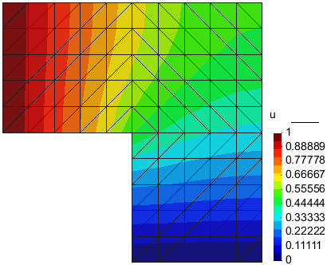
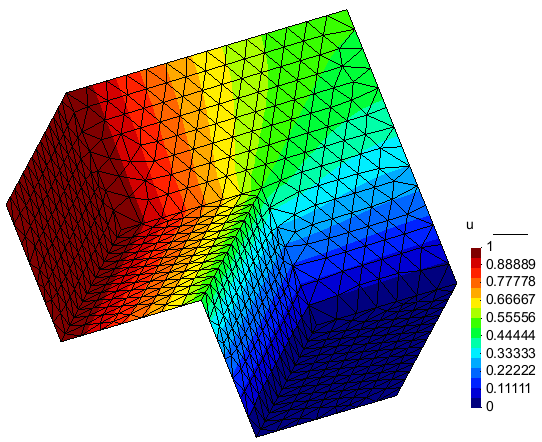
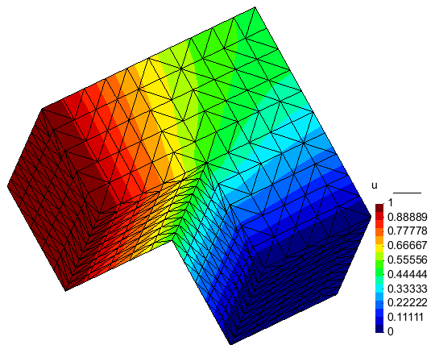
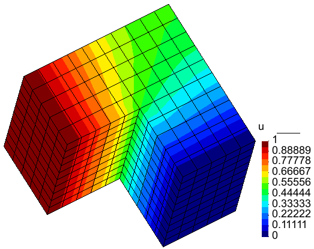

# overview

## exam1

## exam2

## exam3

## exam4 - exam7

| exam4                                                        | exam5                                                        | exam6                                                        | exam7                                                        |
| ------------------------------------------------------------ | ------------------------------------------------------------ | ------------------------------------------------------------ | ------------------------------------------------------------ |
|  |  |  |  |

## exam8 - exam10

| exam8                                                        | exam9                                                        | exam10                                                       |
| ------------------------------------------------------------ | ------------------------------------------------------------ | ------------------------------------------------------------ |
|  |  |  |

